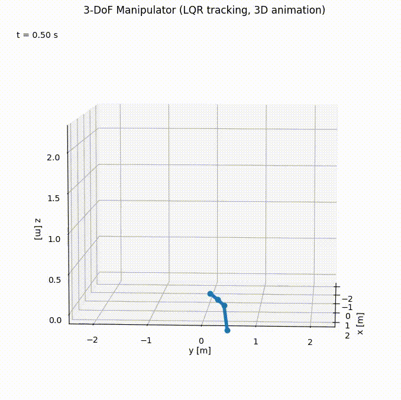
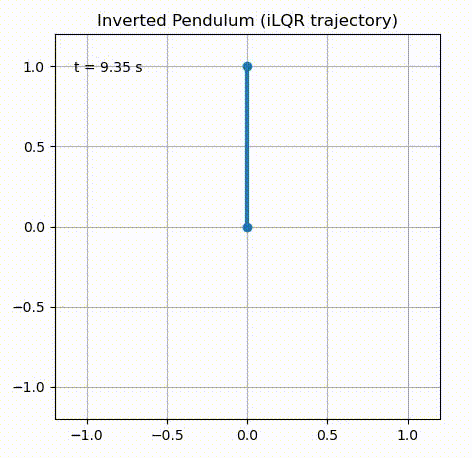
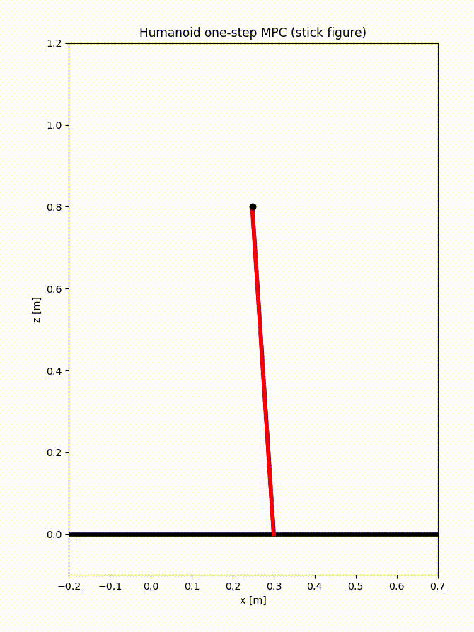
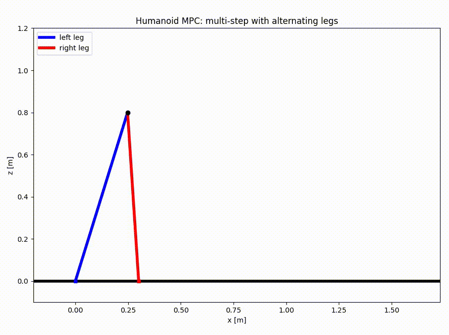

# 🧠 Optimal Control Tutorial

Python implementations of fundamental **Optimal Control** algorithms:

- **LQR** – Linear Quadratic Regulator  
- **iLQR / DDP** – Iterative LQR / Differential Dynamic Programming  
- **MPC** – Model Predictive Control  

This repository is organized for **learning / teaching optimal control**, with clean and minimal Python implementations.

---

## 📂 Repository Structure
```text
Optimal_Control/
│
├── LQR/
│ ├── lqr.py # Continuous-time LQR (solve CARE)
│ ├── double_integrator_lqr.py # LQR demo on double integrator
│ └── manipulator_lqr.py # LQR for n-DOF manipulator (via linearization)
│
├── iLQR/
│ ├── iLQR.py # iLQR / iLQG solver
│ ├── boxQP.py # Box-constrained QP solver for control limits
│ └── demo_inverted_pendulum.py# iLQR demo: inverted pendulum
│
├── MPC/
│ ├── qpmpc/
│ │ ├── mpc_problem.py # Define linear MPC problem
│ │ ├── mpc_qp.py # Convert MPC → QP
│ │ ├── plan.py # Container for MPC results
│ │ └── solve_mpc.py # Solve MPC using qpsolvers
│ └── examples/ (TODO)
│
└── viz/
├── LQR_manipulator.gif
├── iLQR_inverted_pendulum.gif
├── bipedal_mpc_onestep.gif
└── bipedal_mpc_multistep.gif

```

---

# 🎯 Algorithms Overview

## 1️⃣ **LQR — Linear Quadratic Regulator**

LQR solves:

<p align="left">  </p>

for linear dynamics:

<p align="left">  </p>

The optimal control is:

<p align="left">  </p>

where 
P
P solves the Continuous-time Algebraic Riccati Equation (CARE).
### ✔️ LQR Manipulator Example


---

## 2️⃣ **iLQR / DDP — Iterative LQR**

iLQR extends LQR to **nonlinear dynamics**:

\[
x_{k+1} = f(x_k, u_k)
\]

Key steps:
- Linearize dynamics
- Quadratic expansion of cost
- Solve LQR backward pass
- Apply line search update

### ✔️ iLQR Inverted Pendulum Demo


---

## 3️⃣ **MPC — Model Predictive Control**

At each timestep, MPC solves a **finite-horizon optimal control problem**:

\[
\min_{u_{0:N-1}} \sum_{k=0}^{N-1}\|x_k - x_{ref}\|^2 + \|u_k\|^2
\]

Subject to:
- Linear dynamics \(x_{k+1} = A_k x_k + B_k u_k\)
- Control constraints
- State constraints

This repo converts MPC → **QP** and solves it via `qpsolvers`.

### ✔️ MPC Bipedal Example (one-step)


### ✔️ MPC Bipedal Example (multi-step)


---

# ⚙️ Requirements

Install dependencies:

```bash
pip install numpy scipy matplotlib qpsolvers
    
